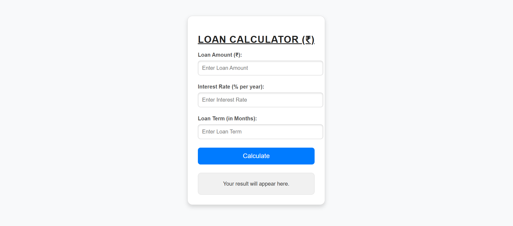

# Loan Calculator

A simple Loan Calculator that allows users to calculate the **monthly payment**, **total interest**, and **total repayment amount** for a given loan amount, interest rate, and loan term.

---

## Features
- Calculate **monthly payments** for a loan.
- View **total interest** paid over the loan term.
- Display the **total repayment amount** (principal + interest).
- Intuitive and user-friendly interface.
- Responsive design.

---

## How to Use
1. Enter the following details into the respective input fields:
   - **Loan Amount**: The principal amount of the loan.
   - **Interest Rate**: The annual interest rate (in %).
   - **Loan Term**: The loan duration (in months).
2. Click on the **"Calculate"** button.
3. View the results:
   - **Monthly Payment**
   - **Total Interest**
   - **Total Repayment Amount**

---

## Project Structure
The project consists of the following files:

- **index.html**: Contains the structure of the calculator.
- **style.css**: Adds styling to the calculator for a clean and modern design.
- **script.js**: Handles the calculations and displays the results.

---

## Formula Used
### Monthly Payment:
\[
M = \frac{P \cdot r}{1 - (1 + r)^{-n}}
\]
Where:
- \( M \): Monthly payment
- \( P \): Loan amount (principal)
- \( r \): Monthly interest rate (annual interest rate divided by 12 and converted to decimal)
- \( n \): Total number of payments (loan term in months)

### Total Repayment:
\[
\text{Total Repayment} = M \cdot n
\]

### Total Interest:
\[
\text{Total Interest} = \text{Total Repayment} - P
\]

---

## Demo
Simply open the `index.html` file in your browser to use the Loan Calculator.

## Preview
The interface of the Loan Calculator looks like this:

## Contribution
Contributions are welcome! If you'd like to enhance this project or add new features:
1. Fork this repository.
2. Create a new branch for your feature (`git checkout -b feature-name`).
3. Commit your changes (`git commit -m "Add feature-name"`).
4. Push to your branch (`git push origin feature-name`).
5. Open a Pull Request.

---

**P.S.** Pay your interest by liking this repo! 😄
